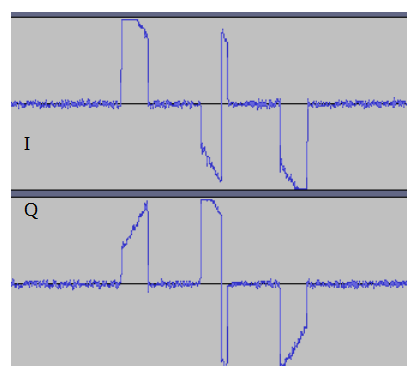

**librpitx** Radio frequency transmitter library for Raspberry Pi (B, B+, PI2, PI3 and PI zero)

It is now the base of *rpitx* project, separate from application

_Copyright (c) Evariste Courjaud F5OEO. Code is GPL_V3

# Installation

```sh
git clone https://github.com/F5OEO/librpitx
cd librpitx/src
make
```

# SendOOK

A new tool is available in "app" : `sendook` allow you to send On Off Keying packend with librpitx.

Modification to the original librpitx : I added an argument parser for command line, and improve the debugging functions. 

## Build
```
# build the lib
cd src
make
# build the app
cd ../app
make sendook
```

## Usage

Run the program in SUDO, even if using the "dry run" switch. It is because of the DMA things of librpitx.
```
usage : sendook [options] "binary code"
Options:
-h : this help
-v : verbose (-vv : more verbose)
-d : dry run : do not send anything
-f freq : frequency in Hz (default : 433.92MHz)
-0 nb : duration in microsecond of 0 bit (by default : 500us). Use integer only.
-1 nb : duration in microsecond of 1 bit (by default : 250us)
-r nb : repeat nb times the message (default : 3)
-p nb : pause between each message (default : 1000us=1ms)

"binary code":
  a serie of 0 or 1 char (space allowed and ignored)

Examples:
  sendook -f 868.3M -0 500 -1 250 -r 3 1010101001010101
    send 0xaa55 three times (with the default pause of 1ms) on 868.3MHz. A 0 is a gap of 500us, a 1 is a pulse of 250us
```
The program return 0 if message send.

### Known limitation

- a gap or a pulse can not be shorter than 10us (options `-0` or `-1`).
- the pulse is not really a pulse : it is not modulated (you cant have a pulse of 7Khz for ex.)
- but the signal is not really a square signal too, because librpitx, for an unkown reason, modulate the generated signal globally :
-- for example, the command `sendook -f 868.3M -0 500 -1 250 -r 3 101010` should generate :
```
| ....    ....    ....
| :  :    :  :    :  :
+-+--+----+--+----+--+----------------------->
```
-- but if record the I/Q of the signal, you will see :


